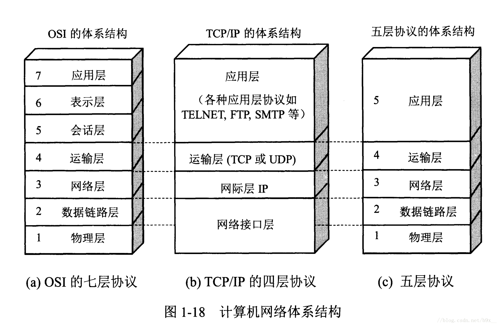
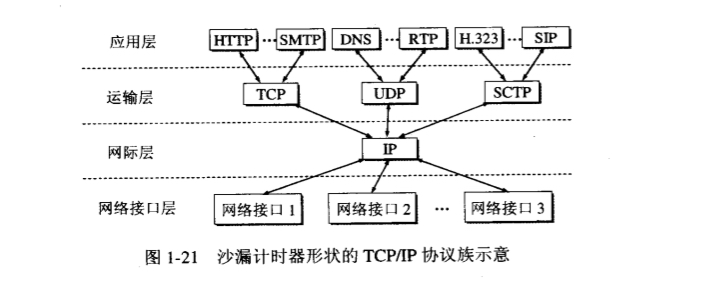

<!-- vim-markdown-toc GFM -->

* [一、概述](#一概述)
    * [1.1 计算机通信模型](#11-计算机通信模型)
    * [1.2 计算机网络的传输技术](#12-计算机网络的传输技术)
        * [1.2.1 广播式链接](#121-广播式链接)
        * [1.2.2 点到点链接](#122-点到点链接)
    * [1.3 交换技术](#13-交换技术)
        * [1.3.1 电路交换](#131-电路交换)
        * [1.3.2 存储-转发交换](#132-存储-转发交换)
    * [1.4 计算机网络参考模型](#14-计算机网络参考模型)
        * [1.4.1 网络体系结构](#141-网络体系结构)
        * [1.4.2 五层协议参考模型](#142-五层协议参考模型)
        * [1.4.3 ISO/OSI七层协议参考模型](#143-isoosi七层协议参考模型)
        * [1.4.4 TCP/IP参考模型](#144-tcpip参考模型)
        * [1.4.5 数据处理流程](#145-数据处理流程)
* [二、物理层](#二物理层)

<!-- vim-markdown-toc -->

# 一、概述

## 1.1 计算机通信模型

- 客户-服务器模型（C/S）：客户号-服务器之间是请求-应答过程。例如：FTP文件下载，HTTP网页浏览。
- 对等通信：每个人可以与其他一个或多个人通信，不存在固定的客户号和服务器角色。例如：迅雷下载。

## 1.2 计算机网络的传输技术

### 1.2.1 广播式链接
- 特点
    - 网络上所有机器共享一个信道；
    - 任何机器发送的数据都可以被其他机器搜到。
- 分类：广播、多播
- 地理位置局部化的网络采用此模式。如局域网：
    - 公共（广播）信道的分配
        - 静态分配
            - 信道预先分配，不随数据的时候及流量等参数而变化
        - 动态分配
            - 信道按照实际需求而动态的分配
            - 包括集中式和非集中式两种
                - 集中式：有一个独立的实体决定信道的下一个使用者（发送者）是谁。
                - 非集中式：每台机器自己决定是否传送数据。

### 1.2.2 点到点链接
- 特点
    - 网络由多个连接构成，一个连接对应一对机器；
    - 数据从源端到目的端可能要经过多台中间机器。
- 别名：单播
- 大型网络通常采用此模式。如广域网：
    - 构成
        - 通信子网和主机
        - 计算机网络=通信子网+资源子网

## 1.3 交换技术

### 1.3.1 电路交换
- 双方建立通信电路连接，并独占该线路的所有数据通信，中间节点不存储任何数据。
- 例如：电话系统

### 1.3.2 存储-转发交换
- 数据分块，每个中间节点完整接收数据块后再发送给下一个节点，在发送之前需要存储接收的数据块。
- 报文交换
    - 例子：电报系统
- 分组交换
    - 和报文交换一样都是先存储再转发，但对数据块的大小有严格限制，使用比报文更小的数据块、更低的延时，更高的系统吞吐量。
    - 计算机网络广泛采用。

## 1.4 计算机网络参考模型

### 1.4.1 网络体系结构

  
 

### 1.4.2 五层协议参考模型
五层协议的体系结构只是为介绍网络原理而设计的，实际应用还是TCP/IP四层体系结构

- 应用层：为特定应用程序提供数据传输服务，例如 HTTP、DNS 等。数据单位为报文。
- 运输层：提供的是进程间的通用数据传输服务。由于应用层协议很多，定义通用的运输层协议就可以支持不断增多的应用层协议。运输层包括两种协议：传输控制协议 TCP，提供面向连接、可靠的数据传输服务，数据单位为报文段；用户数据报协议 UDP，提供无连接、尽最大努力的数据传输服务，数据单位为用户数据报。TCP 主要提供完整性服务，UDP 主要提供及时性服务。
- 网络层：为主机之间提供数据传输服务，而运输层协议是为主机中的进程提供服务。网络层把运输层传递下来的报文段或者用户数据报封装成分组。
- 数据链路层：网络层针对的还是主机之间的数据传输服务，而主机之间可以有很多链路，链路层协议就是为同一链路的结点提供服务。数据链路层把网络层传来的分组封装成帧。
- 物理层：考虑的是怎样在传输媒体上传输数据比特流，而不是指具体的传输媒体。物理层的作用是尽可能屏蔽传输媒体和通信手段的差异，使数据链路层感觉不到这些差异。

### 1.4.3 ISO/OSI七层协议参考模型
比五层协议多两层

  
 

- 表示层：数据压缩、加密以及数据描述。这使得应用程序不必担心在各台主机中表示/存储的内部格式不同的问题。
- 会话层：建立及管理会话。

### 1.4.4 TCP/IP参考模型

它只有简单的四层，上层所有的协议都向下汇聚到一个IP协议中。
TCP/IP协议族可以为各式各样的应用服务提供服务（everything over IP）

  
 

### 1.4.5 数据处理流程

# 二、物理层
物理层考虑的是怎样才能在连接各种计算机的传输媒体上传输数据比特流，而不是指具体的传输媒体。

## 2.1 数据通信的基本概念

### 2.1.1 数据与信息
数据是有意义的实体，涉及的是事物的形式。信息是数据的内容和解释。

数据有模拟数据和数字数据两种形式：

- 模拟数据是指在某个时间区间产生的连续的值。例如，声音和视频、温度和压力等都是连续变化的值 
- 数字数据是指产生的离散的值。例如，文本信息和整数 

### 2.1.2 信号
信号是数据的表示形式，或称数据的电磁或电子编码。它使数据能以适当的形式在介质上传输。

信号有模拟信号和数字信号两种基本形式：

- 模拟传输：不考虑传输的内容。长距离传输时，采用信号放大器放大衰减的信号。
- 数字传输：关心信号的内容，不论传输的数字信号还是模拟信号。长距离传输时，采用转发器，消除噪声的累积。

长距离传输时，通常采用的是数字传输。
模拟信号在传输中会产生波形失真，难以还原。
数字传输只要能正确区分0/1就足够了，这样使得数字传输比模拟传输更可靠。

### 2.1.3 信道工作方式

- 单工通信：单向传输。如广播、电视
- 半双工：双方都可以发送或接收，但不能同时，即当一方发送时，另一方接收
- 全双工：双方同时可以发送和接收信息，需要两条信道

### 2.1.4 同步与异步通信

#### 同步通信
同步通信是指发送方和接收方的采样时钟是同一个。通常发送方在发送数据的编码中包含时钟，而接收方则从数据流中提取时钟用以采样。所以说双方所用的时钟是同一个。

根据同步通信规程，同步通信又分为面向字符的同步通信和面向bit流的同步通信

#### 异步通信
异步通信是指发送方和接收方的采样时钟不是同一个。是以字符为单位的数据传输。数据块以字符为单位并以特殊的位作标志，每个字符都要附加1位起始位和1位停止位，以标记字符的开始和结束。此外，还要附加1位奇偶校验位

异步通信必须指定的四个参数：

- 波特率
- 字符长度
- 奇偶校验
- 停止位长度

### 2.1.5 串行通信和并行通信

- 串行通信：数据按位为单位以时间为序
- 并行通信：数据按字符为单位（多位同时）以时间为序

## 2.2 波特率与比特率

- 波特率：信号变化次数（每秒采样的次数），单位是baud(波特)
- 比特率：数据传输速率，单位是bps、b/s等。

两者之间的差别在于每次采样的量化值

### 2.2.1 波特率与比特率的关系
如信号分为V级，则比特率 = (log2V) ×波特率

这里V表示每个波特的信号调制等级，代表调制技术(每次采样的位数)的高低

## 2.3 数字信号的Fourier分析
## 2.4 最大数据传输率与带宽的关系
## 2.5 数据传输
## 2.6 物理层标准例子
## 2.7 多路复用
## 2.8 交换技术
## 2.9 传输介质
## 2.10 电话系统
## 2.11 Internet的本地接入